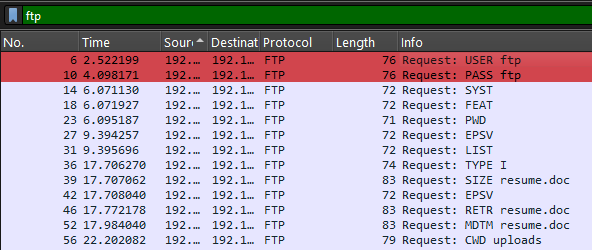

# Wireshark Scan #1

### 🕵️‍♂️ **Case Title:** FTP-Cleartext Credentials Analysis

**Date:** July 17, 2025

**Session Length:** ~3 hours

**Analyst:** Jinay ***[a.k.a. Jynx]***

---

### 🧠 Objective

To analyze FTP traffic from a PCAP file and extract cleartext login credentials. Document findings, tools used, and implications for secure protocol usage.

---

### 📂 **File Metadata**

| Attribute | Info |
| --- | --- |
| 📁 File Name | `ftp_login.pcap` |
| 📦 Source | ***Download file: 
[[https://www.cloudshark.org/captures/abdc8742488f](https://www.cloudshark.org/captures/abdc8742488f) ]*** |
| 📅 Likely Date of Capture | Unknown (lab-generated) |
| 🧪 Content | Cleartext FTP authentication over TCP |
| 🔍 Size | ~60–80 KB |
| 🖥️ Protocols in Use | TCP, FTP (port 21) |
| 🧱 Use Case | Beginner protocol analysis & credential extraction |
| 🌐 Source IP | ***192.168.1.182*** |
| 🌐 Destination IP | ***192.168.1.231*** |

---

### 🛠️ Tools Used

- Wireshark GUI on Windows 11
- Filters: `ftp`, `ftp.request.command`, `tcp.stream eq 0`
- Follow TCP Stream feature
- Notion for documentation

---

### 🧪 Step-by-Step Analysis

1. **Opened PCAP in Wireshark**
2. Applied display filter: `ftp`
3. Identified FTP login request (`USER`, `PASS`)
4. Right-clicked → Follow → TCP Stream
5. Saw credentials in cleartext:
    
    ```
    USER ***ftp***
    PASS ***ftp
    [Anonymous Login: " 230 Anonymous access granted, restrictions apply. "]***
    ```
    
6. Noted IPs, ports, direction of flow
7. Assessed risk (cleartext login can be intercepted)

---

### 🚨 Findings

- FTP credentials were sent in plain text
    
    
    
    
    
- No encryption (no TLS/SSL)
- Could very comfortably illustrate the sequence of command operated, could lead to serious security triage or exploit.
- Source IP ***192.168.1.182*** attempted login to destination ***192.168.1.231***

---

### 🧠 Takeaways

- Legacy protocols like FTP are dangerous
- Wireshark can extract creds in seconds, if outdated or unreliable protocols are still in use or if security patches are not timely updated.
- Proper filtering and stream reconstruction is key

---
