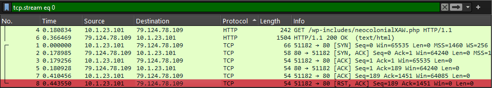

# Wireshark Scan #2

## 🕵️‍♂️ **Case Title:** Wireshark Investigation – KOI Loader

**Date:** July 17, 2025

**Session Length:** ~3 hours

**Analyst:** Jinay ***[**a.k.a. **Jynx]***

---

## 🧠 Objective

Investigate a packet capture from a suspected KOI Loader malware infection. Track infection vectors, payloads, and potential data exfiltration routes.

## 🧾 Metadata

| Item | Detail |
| --- | --- |
| **Case Name** | KOI Loader Wireshark Investigation |
| **PCAP** | ***koi_loader_infection.pcap*** |
| **Tool** | Wireshark v4.x |
| **Date** | July 18, 2025 |

## 🔎Filters & Findings

- `tcp.stream eq 0` → Found [Artifact #1](https://www.notion.so/Wireshark-Scan-2-234d0bad0c3080f88ba4fc3a1de75654?pvs=21)
- `tcp.stream eq 1` → Found [second](https://www.notion.so/Wireshark-Scan-2-234d0bad0c3080f88ba4fc3a1de75654?pvs=21) [third](https://www.notion.so/Wireshark-Scan-2-234d0bad0c3080f88ba4fc3a1de75654?pvs=21) and [fourth](https://www.notion.so/Wireshark-Scan-2-234d0bad0c3080f88ba4fc3a1de75654?pvs=21) stages of malware dropper chain.
- `tcp.stream eq 2` → Data [exfiltration](https://www.notion.so/Wireshark-Scan-2-234d0bad0c3080f88ba4fc3a1de75654?pvs=21) traffic.
- `tcp.stream eq 2` → Malware Sophistication and [Process Hollowing](https://www.notion.so/Wireshark-Scan-2-234d0bad0c3080f88ba4fc3a1de75654?pvs=21).

---

## 📜Extracted Artifacts *[**Staged Malware Chain Analysis**]*

### 🔓**Artifact** #1

| File | Type | Observations | TCP [Port] | IP |
| --- | --- | --- | --- | --- |
| ***malware-sample.pcapng*** | File less malware delivery via PowerShell. | User-Agent string contains `WindowsPowerShell`, indicating **non-browser automated access**. **Transfer-Encoding: chunked** suggests streamed delivery, often used to evade simple AV signatures. Downloads & executes remote PowerShell scripts via `Invoke-WebRequest` and `IEX`. | 51182 | `ip.addr = 79.124.78.109` |

### 🔒 Indicators of Compromise (IOC)

| Type | IOC |
| --- | --- |
| IP Address | **79.124.78.109** |
| Domain | ***/wp-includes/neocolonialXAW.php*** |
| Filename | `r<MachineGUID>r.js`  [dynamically created with `WScript.ScriptName` ] |
| PowerShell Payload URLs | `http://79.124.78.109/wp-includes/phyllopodan7V7GD.php` 
`http://79.124.78.109/wp-includes/barasinghaby.ps1` |
| Behavior | PowerShell download cradle using `Invoke-WebRequest` + obfuscated script using `ActiveXObject`, `RegRead`, file copy, and deletion. |

### 🔓**Artifact** #2

| File | Type | Observations | TCP [Port] | IP |
| --- | --- | --- | --- | --- |
| ***phyllopodan7V7GD.php*** | Returns a PowerShell obfuscated blob. | sends back a small PowerShell snippet:
`powershellCopy code$vl1 = ("yyWubZ...EC9F" -match "iTqmHcYttKZ7")
$v2=$c.GetFields("NonPublic,Static")
Foreach($v3 in $v2) {if ($v3.Name -like "*am*ed") {$v3.SetValue($null, $vl1)}` | 1514 | `ip.addr = 79.124.78.109` |

### 🔒 Indicators of Compromise (IOC)

| Type | IOC |
| --- | --- |
| IP Address | **79.124.78.109** |
| Domain | ***/wp-includes/phyllopodan7V7GD.php*** |
| Filename | `phyllopodan7V7GD.php` |
| PowerShell Snippet
[What It Means] | `$vl1`: This is junk obfuscated data — the string is crafted to contain hidden info (possibly a trigger or obfuscation residue).

`$c.GetFields(...)`: `$c` was likely defined in a previous script as a `.NET type` (maybe one with elevated privileges or dangerous properties).

`.SetValue(...)`: It tries to inject/assign values into system memory — possibly setting up for **reflective memory injection** or **configuration corruption**. |
| Behavior | This is a **setup/priming stage**. It modifies the runtime environment in preparation for the next payload. |

### 🔓**Artifact** #3

| File | Type | Observations | TCP [Port] | IP |
| --- | --- | --- | --- | --- |
| ***barasinghaby.ps1*** | Main attack payload | Function: `GDT`:Creates a **dynamic .NET assembly**, dynamically defining a **delegate type** — this is a method of crafting *executable code in memory*, bypassing disk forensics. 
Function: `GPA`:Wraps access to Windows API functions like `GetProcAddress`, `GetModuleHandle`.
This is a **low-level memory exploit** — typically used to inject and execute shellcode by getting function pointers directly from memory. | 1514 | `ip.addr = 79.124.78.109` |

### 🔒 Indicators of Compromise (IOC)

| Type | IOC |
| --- | --- |
| IP Address | **79.124.78.109** |
| Domain | ***/wp-includes/barasinghaby.ps1*** |
| Filename | `barasinghaby.ps1` |
| PowerShell Payload URLs | `http://79.124.78.109/wp-includes/barasinghaby.ps1` |
| Behavior | **Downloads a binary payload (EXE)** and stores it in memory as a byte array.  |

### 🔓**Artifact** #4

| File | Type | Observations | TCP [Port] | IP |
| --- | --- | --- | --- | --- |
| `guestwiseYtHA.exe` | Fetched EXE payload | Final binary malware — possibly ransomware or RAT | 1514 | `ip.addr = 79.124.78.109` |

### 🔒 Indicators of Compromise (IOC)

| Type | IOC |
| --- | --- |
| IP Address | **79.124.78.109** |
| Domain | ***/wp-includes/guestwiseYtHA.exe*** |
| Filename | `guestwiseYtHA.exe` |
| Behavior | It is the downloaded binary payload (.exe) that executes the binary instructions stored in the memory as a byte array without creating a file, to avoid disk forensic frisking. |

### 🔓**Artifact** #5

| File | Type | Observations | TCP [Port] | IP |
| --- | --- | --- | --- | --- |
| ***flocking.php*** | Malware beaconing and exfiltrating system identifiers or data | **command-and-control (C2)** or **data exfiltration traffic**. The malware sends encoded data or system identifiers back to the attacker-controlled server at IP `79.124.78.109`, specifically to `flocking.php`. | 51184 | `ip.addr = 79.124.78.109` |

### 🔒 Indicators of Compromise (IOC)

| Type | IOC |
| --- | --- |
| IP Address | `79.124.78.109` |
| URL | `http://79.124.78.109/flocking.php` |
| Path | `/flocking.php` |
| Machine GUID | `6eac11b8-35d6-bffe-da50-d9e1a5ae832a` |
| Payload Type | `application/octet-stream` |

### 🔓**Artifact** #6

| File | Type | Observations | TCP [Port] | IP |
| --- | --- | --- | --- | --- |
| ***index.php*** | Sophisticated malware infrastructure, intercepted a key **stage of process hollowing** delivery via **PowerShell-based code injection**. | It defines **low-level Windows structures and API imports** (`CreateProcess`, `GetThreadContext`, `VirtualAllocEx`, etc.)Uses **PowerShell Add-Type** to embed **C# structs and functions.**
It loads a binary (likely EXE or shellcode) into memory and performs **process hollowing**: it launches `chrome.exe` in suspended mode, Unmaps its memory, Injects malicious code into it, alters its thread context to point to the malicious code and resumes the thread, now running **attacker’s payload** under the disguise of Chrome | 51187 | `ip.addr = 79.124.78.109` |

### 🔒 Indicators of Compromise (IOC)

| Type | IOC |
| --- | --- |
| URL | `http://79.124.78.109/index.php?ver=64` |
| Delivery | PowerShell GET + fileless code |
| Technique | Process Hollowing via PowerShell + Add-Type |
| Injection Target | `chrome.exe` (suspended process) |
| Suspicious Function | `Invoke-IElevator()` |
| Malware Behavior | In-memory PE injection |
| User-Agent | `WindowsPowerShell/5.1.26100.2161` |

---

## 📚 Learning Outcomes

- Learned stream reconstruction via TCP/HTTP.
- Performed payload extraction.
- Identified possible FTP-based command transmission.
- Practiced IOC hunting using Wireshark filters.
- Built pattern recognition for malware and web based PowerShell and JavaScript/Vb.net scripting techniques.
- Analyzed Process Hollowing Technique.
- Navigated Forensic Roadblocks.
